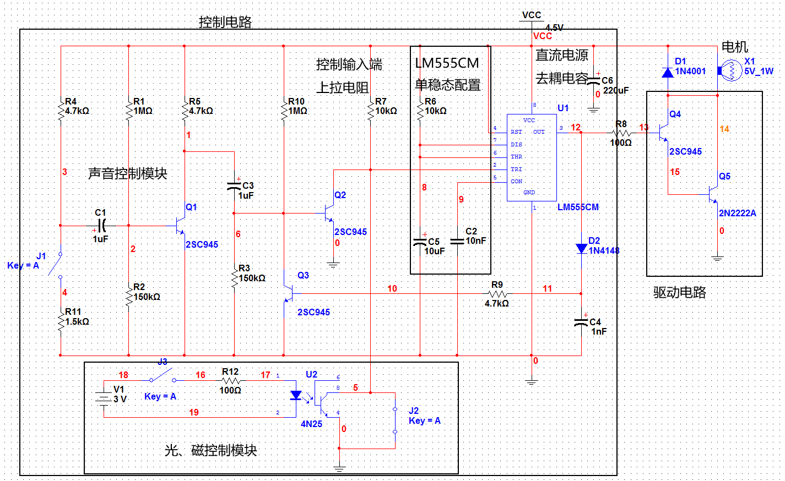
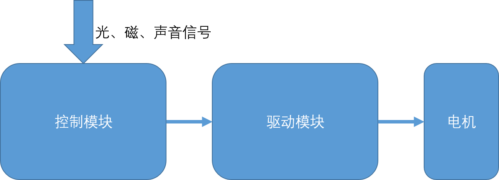
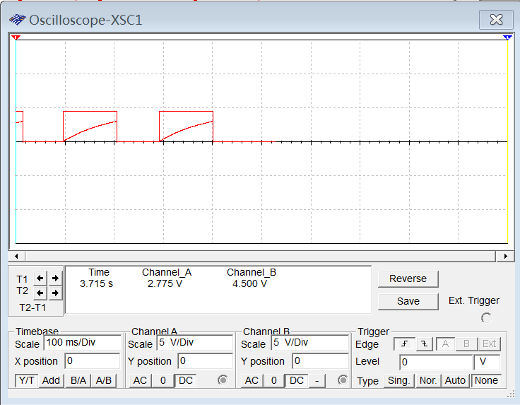
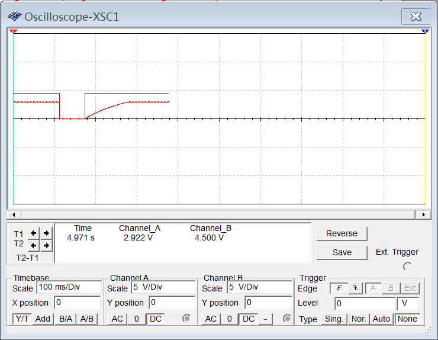
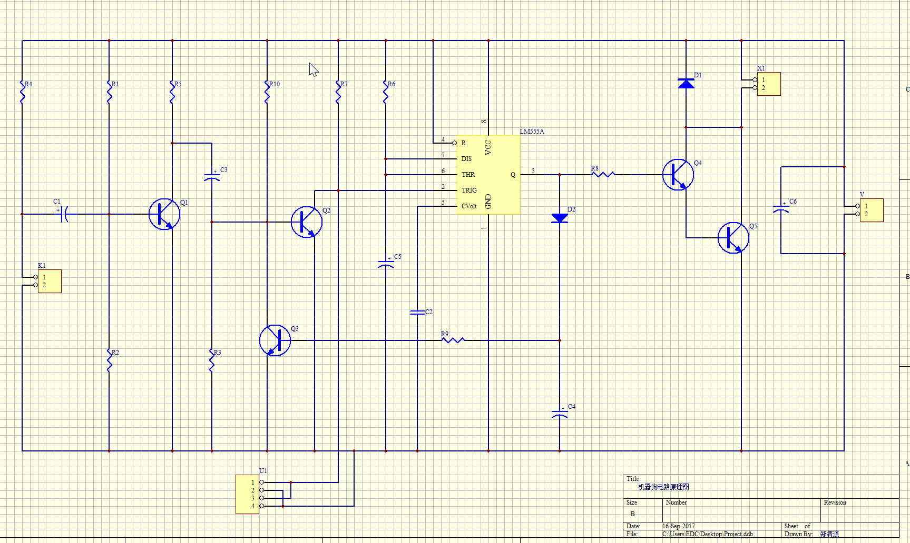
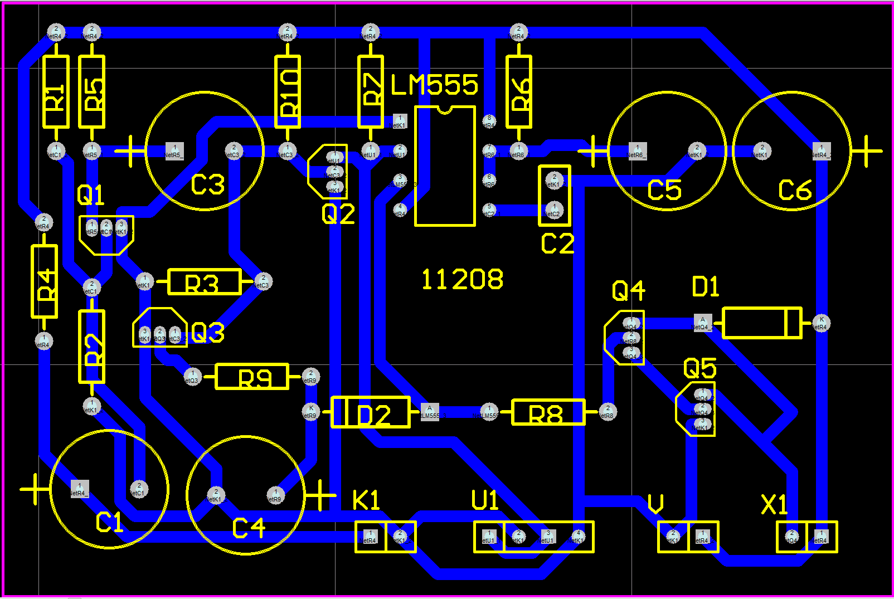

# 电子工艺实习实习报告草稿

## 焊接工艺

### 焊接工艺的基本知识

焊接是一种以加热方式接合金属或其他热塑性塑料的工艺及技术，由于其具体工艺种类繁多，应用广泛，在这里不再赘述。

在本次实习中，我们使用的技术为软钎焊，是一种利用熔化熔点较低金属来连结其他金属工件的制造过程，常用在印刷电路板上电子零件的组立。其中，被熔化的金属称为焊料，一般其熔点低于400摄氏度。

若无特殊说明，下文中的焊接均指软钎焊。

### 焊接工具、焊料、焊剂的类别和作用

#### 焊接工具

焊接工具是用于提供能量熔化焊料的工具，在实验室中，常使用电烙铁。

电烙铁一般由烙铁头、烙铁芯、手柄、电源引线组成，根据其发热部件的相对位置可以分为两类：

- 外热式电烙铁：烙铁头寿命长，功率大；但发热效率低，预热时间久，体积较大
- 内热式电烙铁：发热快，发热效率较高，且其体积较小，更换烙铁头方便，价格便宜

在实际焊接时，应根据需求选择恰当功率和尺寸的电烙铁，使焊料能及时熔化、凝固、粘合在焊点，方便实际操作。本次实习中，我们使用了功率为20W的内热式电烙铁。

#### 焊料

如上文指出，焊料是用于连结多个金属工件的低熔点金属，其能在烙铁头的作用下熔化为液体，浸没待焊元件，并在烙铁头离开后迅速凝固，提供不错的机械强度，从而达到连结金属工件的效果。

最常用的焊料为锡铅焊料，不过为了避免铅废弃物危害环境，锡铅焊料正被逐渐淘汰而改用其他无铅焊料。常用的手工焊料中还往往包裹着松香等焊剂的芯，方便人们手焊。

####焊剂

焊剂，又称助焊剂，在焊接中扮演还原剂的角色，将高温下焊点的金属氧化物还原为金属，进而提高焊接品质。同时，焊剂还能起到润湿剂的作用，能降低被焊接材质表面张力，使液态的熔融焊料能完整覆盖焊点，保证焊接效果。

在焊接锡时，常用焊剂为松香或氯化铵等。

###焊接方法

#### 元件焊接顺序

焊接时应按照从里到外，从小到大的顺序，以防止焊好的元件堵住通路。并且应先焊接对高温不敏感的元件（如电阻、电容），再焊接对温度敏感的元件（如二极管、三极管、IC）。

#### 焊接步骤

1. 将**合适数量**的元件预先插入PCB板并**折弯管脚**以防掉落
2. 将**预热过的**电烙铁轻轻靠在焊点上，加热焊点
3. 将焊锡放在已加热的焊点上，其会自动熔化、吸附并浸没在焊点上
4. 拿走焊锡，再将烙铁轻轻从上方拿走，由于表面张力的作用，液态的锡会自动在焊点上形成一个拱顶，并快速凝固
5. 焊好所有焊点以后，**剪掉露出的管脚**
6. 重复以上步骤，直到焊好所有的元件

#### 注意事项

- 一个焊点上的焊锡适量即可，一般焊接一个焊点只需要3、4秒
- 不要一次性插入过多的元件，以防干扰焊接过程
- 插入极性元件时应注意其极性，且要参考具体手册，不宜鲁莽判断
- 注意元件在PCB板两面露出的管脚应尽量地短，以防意外短路、充当天线等情况
- 对于IC等管脚较多且短的元件，可以在烙铁上预先熔化一些焊锡，将其任意对角线上的两个管脚先焊好，这样元件就不会掉落了
- 由于有些非连通的焊点十分接近，要注意防止短路

#### 意外处理

虽然在焊接前应再三确认连接正确，但当连接错误时也应规范地拆焊：

1. 用电烙铁将焊点上地焊锡加热至熔融
2. 用吸锡器将焊点上地液态焊锡抽走

## 原理图设计与仿真

### Multisim仿真电路

其模块框图如下：

控制模块接收光、磁、声音信号，并将其通过放大电路或IC转化为电压信号后通过功率放大电路驱动电机（以及音乐芯片）运行或停止。

#### 控制模块

控制模块的核心是LM555CM的IC以及R6, C2, C6共同组成的单稳态脉冲发生器，当IC的TRI端子输入电压低于三分之一电源电压时，IC开始输出高电平，C2开始充电，当且仅当TRI输入高电平且C2电压高于三分之二电源电压时，IC输出回到低电平。

IC的TRI端子有三个输入：

1. 上拉电阻R7提供默认的高电平输入。
2. 光、磁输入：光、磁传感器接受外界输入时，其电阻大幅下降，相当于闭合的开关，将TRI端子电压强行拉至地面，提供低电平输入。
3. 声音输入：当麦克风有声音信号输入时，其内部产生感应电流，若足够大，则C1开始放电并通过Q1共射反向放大带动C3放电，从而R3处有一个向上的电流导致Q2基极电压上升，从而使Q2导通，拉低了TRI端子处电压。此时IC被触发，输出高电平，其电压反馈至Q3使其导通，又拉低了Q2基极的电压，使其截止，结束低电平输入。然而由于此时C2仍然在充电，故IC仍会在一段时间内输出高电平，持续时间为1.1\*R6\*C6。

#### 驱动模块

注意由于IC的驱动能力（放电流能力）有限，其往往无法直接驱动一个功率较大的后级运行，故需要一个晶体管放大电路为电机运行提供充足的电流。

### 电路仿真波形

J1(对应麦克风)改变LM555CM 3、6脚波形如下：

J2或J3(对应单簧管或光电二极管)闭合时LM555CM 3、6脚波形如下:

## 印制板设计

### 电路原理图

### 机器印制板图

印制板具体配置过程如下：

- 配置PCB显示层：Design-Options-Layers
- 设置仅在底层布线：Design-Rules-Routing-Routing Layers; 将TopLayer改为NotUsed而BottomLayer改为Any
- 设置线宽：Design-Rules-Routing-Width Constraints; 将三个值均改为40mil
- 设置KeepoutRegion：在KeepoutLayer用直线画出一个3000mil*2000mil的封闭矩形即可

## 机器狗的焊接、安装及调试

### 机器狗的基本工作原理

放在机器狗内部的传感器感应外部光、磁、声音信号，并将其转化为电信号通过内部电路控制电机的旋转（以及音乐芯片发声），并通过机械传动装置转化为其四肢的动作。

详细电路原理解读见原理图与设计仿真-Multisim仿真电路

### 元器件的识别与测试

- 色环电阻：色环电阻的大小标识类似于科学记数法，又分为四环和五环。
- 独石电容：独石电阻的大小通过文字直接标识电容体上，其格式往往为10n，代表10*10^n pF
- 电解电容：电解电容为极性元件，根据约定，一般管脚较长一侧为正极，其大小往往直接在电容体上使用文字标识。
- 二极管：二极管为极性元件，根据约定，一般有色环一侧为正极。

### 机器狗的焊接

在焊接机器狗时，应把其各个部件均插下，以便焊接操作。

PCB板部分的焊接，具体步骤已在上文焊接工艺-焊接方法中给出，这里不再赘述。而电机两端改线焊接时，应注意稳定住已经焊好的导线，防止其意外掉落。

另外，由于三个传感器并不能够直接焊接在PCB板上，而需要外接导线的连接，因此存在额外的注意事项：

- 单簧管：单簧管的玻璃材质十分脆弱，直接将导线焊至其管脚一端即可，不宜做额外的弯折
- 光电二极管：由于光电二极管连个管脚十分接近，在完成管脚与导线的焊接后应使用热缩管裹住一极，防止意外短路
- 麦克风：麦克风使用屏蔽线连接至PCB板，内芯接负极，外围接正极。

### 机器狗的组装

组装机器狗时应时刻传感器的位置，在安装光电二极管时，需要在狗体上焊出一个洞，宜从体内向外焊，再通过螺丝刀打磨。注意脚上的螺丝不能太紧，否则容易损坏电机，连接处应存在适量的润滑油。

###机器狗的调试

在调试机器狗时，应先直接在PCB板上测试，方便发生错误时调试、修改。在确认无误后再进行机器狗组件的拼装。

## 实验总结和心得体会

以往的课程往往从电路的设计入手，而本次实习注重于电路的实现，其中包括了EDA仿真，PCB设计，以及实际印制板的焊接。

###EDA仿真

EDA仿真是本次实习与过去实验的重叠部分，通过过去三个的电子电路实验课程（尤其是上个小学期数控音频功放电路的设计中），我已经对Multisim的使用十分熟悉，因此在电路的连接和仿真测试中没有出现任何问题。

###PCB设计

PCB设计实现中使用的Protel99SE是一个非常古旧的软件，由于其操作逻辑奇异，且在高分辨率屏幕下字体难以阅读，导致了使用时工作效率极端低下。不过在完成作业的过程中，我也大致了解简单的PCB板的设计过程：

- 通过软件提供的电路结构界面连接设计好的电路
- 设置各个元件的封装尺寸
- 生成文本描述的电路拓扑结构（在该软件中体现为NET文件）
- 将拓扑结构导入至PCB设计界面中，自动生成元件及逻辑连线，并手工进行适当的排版
- 设置各项参数后自动布线

虽然布线是自动的过程，但是布线的质量却很大程度上取决于手工排版，因此小心细致的排版是PCB设计的关键。当系统内置封装与实际封装有区别时，可能还需要手动修改NET文件来纠正。

### 焊接

焊接主要是机械劳动，掌握技巧即可熟练地进行。在最初的焊接练习中，由于各种原因导致第一个早上基本没有进度，在后两个半天中尽力追赶中才勉强完成。但仍然可以感受到自身技术水平的进步。

值得注意的是，在焊接前再三确认连线正确后，整个焊接的过程应一步到位，由于焊剂芯的存在，虚焊很少出现，而使用过多的焊料导致短路更容易发生。另外，焊接地动作要快速，以防焊点过热脱落从而报废整张PCB板抑或损坏不耐热的元器件。

## 参考资料

- [焊接 维基百科](https://zh.wikipedia.org/zh-cn/%E7%84%8A%E6%8E%A5)
- [软钎焊 维基百科](https://zh.wikipedia.org/zh-cn/%E8%BD%AF%E9%92%8E%E7%84%8A)
- [焊料 维基百科](https://zh.wikipedia.org/zh-cn/%E9%8A%B2%E6%96%99)
- [LM555CM Datasheet](https://www.ti.com/lit/ds/symlink/lm555.pdf?HQS=TI-null-null-alldatasheets-df-pf-SEP-wwe)